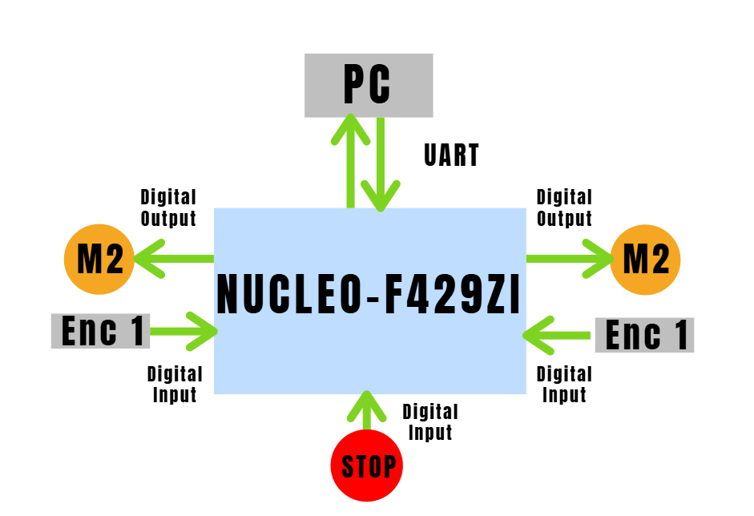

# TP1: sistemas embebidos

## Titulo: Robot móvil tipo diferencial para búsqueda y localización de personas.

## Alumno: 

Brian Alex Fuentes Acuña

## Objetivo: 

Desarrollar un robot móvil tipo diferencial para implementación de algoritmos de búsqueda y localización mediante visión.

## Descripción:  

El robot debe poder funcionar en dos modos MANUAL y AUTOMÁTICO en donde el primero consiste en un robot que sigue las velocidades lineales [ $v(t)$ , $w(t)$ ] las cuales serán suministradas mediante XXXX a través de un computadora conectada a un Joystick.
El modo AUTOMÁTICO será comandado también por velocidades [ $v(t)$ , $w(t)$ ] pero de forma automática a través de la conexión XXXXX  a la computadora (debido al peso de estos algoritmos).

El robot contará con una conexión a una cámara para visión (Cámara  monocular tipo Raspberry o Sensor Kinect) el mismo se usará para detectar a las personas y transmitir mediante I2C hacia la placa (la NUCLEO-F429ZI admite también DCMI).

Para esta primera etapa todos los sensores serán simulados mediante entradas digitales o analógicas.

Para la identificación de una persona  (MODO AUTOMÁTICO) se mandaran coordenadas en el espacio de la imagen (ej Size: 32x32 - > pose_yz: (14,20) ) mediante UART.

Para la enviar señales (MODO MANUAL) de velocidad lineal ( $v(t)$ ) y velocidad angular ( $w(t)$ ) se enviaran al micro. mediante UART.

Para simular los motores se utilizarán dos LEDs  el cual encendieran y apagaran proporcionalmente a la velocidad necesaria para cada ruda ( $w(t)_L$, $w(t)_R$ $\in$ [$W_{min}$ , $W_{max}$] )

Ademas se implementará un boton digital de parada de emergencia.

## Periféricos a utilizar:

* **BUTTOM_STOP** : Entrada digital, fuerza la detención del robot llevándolo a un estado seguro.
* **M1** : Salida digital LED1 que emula un motor controlado por PWM.
* **M2** :  Salida digital LED2 que emula un motor controlado por PWM.
* **ENCODER_1** : Entrada digital, simula un encoder tomando las pulsaciones del LED1. 
* **ENCODER_1** : Entrada digital, simula un encoder tomando las pulsaciones del LED2. 
* **UART**:  Se utiliza para enviar datos de referencia o control al microprocesador.

## Plataforma de desarrollo: NUCLEO-F429ZI

## Esquematico:

## Bibliografia: 
https://ria.utn.edu.ar/server/api/core/bitstreams/1bbbbe5b-096e-4df5-8a84-a869f0a48766/content

