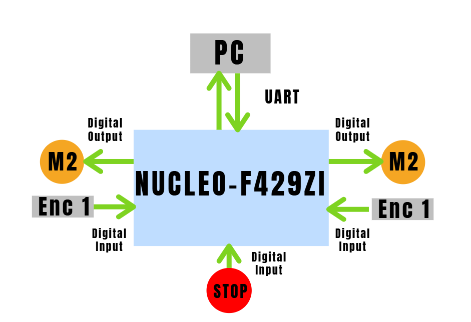

# TP2: sistemas embebidos

## Titulo: Robot móvil tipo diferencial para búsqueda y localización de personas.

## Alumno: 

Brian Alex Fuentes Acuña

## Objetivo: 

Desarrollar un robot móvil tipo diferencial para implementación de algoritmos de búsqueda y localización mediante visión.

## Descripción:  

El robot debe poder funcionar en dos modos MANUAL y AUTOMÁTICO en donde el primero consiste en un robot que sigue las velocidades lineales [ $v(t)$ , $w(t)$ ] las cuales serán suministradas mediante UART a través de un computadora conectada a un Joystick.
El modo AUTOMÁTICO será comandado también por velocidades [ $v(t)$ , $w(t)$ ] pero de forma automática a través de la conexión UART  a la computadora (debido al peso de estos algoritmos).

El robot contará con una conexión a una cámara para visión (Cámara  monocular tipo Raspberry o Sensor Kinect) el mismo se usará para detectar a las personas y transmitir mediante I2C hacia la placa (la NUCLEO-F429ZI admite también DCMI).

Para esta primera etapa todos los sensores serán simulados mediante entradas digitales o analógicas.

Para la identificación de una persona  (MODO AUTOMÁTICO) se mandaran coordenadas en el espacio de la imagen (ej Size: 32x32 - > pose_yz: (14,20) ) mediante UART.

Para la enviar señales (MODO MANUAL) de velocidad lineal ( $v(t)$ ) y velocidad angular ( $w(t)$ ) se enviaran al micro. mediante UART.

Para simular los motores se utilizarán dos LEDs, los cuales se encenderán y apagarán proporcionalmente a la velocidad necesaria para cada rueda ($w_L(t)$, $w_R(t)$ $\in [W_{min}, W_{max}]$).

Ademas se implementará un boton digital de parada de emergencia.

## Periféricos a utilizar:

| Componente       | Tipo             | Función                                     |
|------------------|------------------|---------------------------------------------|
| `BUTTON_STOP`    | Entrada digital  | Parada de emergencia                        |
| `M1` / `M2`      | pwm out          | Controla motor mediante pwm.                |
| `ENCODER_1/2`    | Entrada digital  | Cuenta ticks de un lm393                    |
| `UART`           | Comunicación     | Entrada de comandos de velocidad o posición |
## Plataforma de desarrollo: NUCLEO-F429ZI

## Esquematico:



---

## **Implementación**

Este código implementa el control de un **robot móvil diferencial**. 
Está diseñado para manejarse en **modo manual o automático**.


Nota: La estructura se basa en la ejecución secuencial de eventos con tiempos de muestreo fijos.
Nota: Los tiempos fijos se mantenienen ahora dentro de cada modulo.


# **1. Estructura General**
El programa sigue un **bucle principal (`main()`)** donde:
1. **Inicializa** entradas, salidas y el controlador PID.
2. **Verifica botón de emergencia** mediante interrupcción.
3. **Maneja el modo de operación**:
   - En **modo manual**, lee comandos UART cada 100 ms para modificar velocidades (limitados).
   - En **modo automático**, de momento genera valores aleatorios de velocidad (limitados).
4. **Calcula las velocidades de las ruedas** según la cinemática diferencial.
5. **Aplica velocidades a los motores**, en lazo abierto o cerrado.

El control de tiempo se implementa de manera secuencial mediante **contadores de tiempo acumulados** (`accumulatedTimeX`), sin usar interrupciones.

---

# **2. Componentes Clave**

/robot_firmware/
├── main.cpp                         # Punto de entrada
├── CMakeLists.txt                   # Sistema de build de Mbed
├── config/
│   ├── robot_config.h               # Parámetros físicos, PID, límites, etc.
│   └── pinout_default.h             # Asignación de pines por defecto
├── hardware/
│   ├── encoder.cpp/.h               # Lectura de encoders
│   ├── motor_driver.cpp/.h          # Control PWM, on/off de motores
│   ├── emergency_button.cpp/.h      # Lectura de botón de parada
│   └── uart_interface.cpp/.h        # Comunicación serie con usuario (no implementado)
├── control/
│   ├── pid.cpp/.h                   # Controlador PID genérico
│   └── motor_control.cpp/.h         # Lazo abierto y cerrado usando PID
├── motion/
│   └── kinematics.cpp/.h            # Interfaz base para modelos cinemático
├── modes/
│   ├── modes.cpp/.h                 # Modo de operación manual # Modo de operación automática
│   └── mode_manager.cpp/.h          # Gestión de cambio de modos
├── utils/
│   └── logger.cpp/.h                # Debug por UART (implementar base de errores para manejo de errores posteriormente)
└── docs/
    └── README.md                    # Documentación del sistema y cómo extenderlo

## **2.1. Configuraciones**
- Contiene parametros fisicos y tiempos que se usan en la mayoria de los modulos.
- Contiene definiciones de pines de entrada y salida asi como los de UART.

## **2.2. Modulos de Harware**
- encoder.cpp: implementa toda la logica de un encoder fisico, este encoder esta basado en contar ticks cada cierto tiempo (configurable en robot_cofig.h).
- motor_driver.cpp: Implementa un motor de continua, convierte velocidades de referencia en duty cycle para un pwm (usa pwmOut).

### **2.3. Modulo de control**
- pid.cpp: Implementa un control PID.
Se implementa un **control PID básico** con los términos:
$$
u = K_p e + K_i \int{e dt} + K_d \frac{de}{dt}
$$
Donde:
- $ e $ es el error ($ \text{setpoint} - \text{valor medido} $)
- **Integral y derivativa** se calculan de forma discreta.

Para evitar valores extremos, se usa **saturación de salida**:
```cpp
if (saturationEnabled){
    return max_(min_(outPut, outputMax), outputMin);
}
```

- motor_control.cpp: Se encarga del control a lazo abierto o cerrado(usando pid) del motor dc, usa el encoder para obtener velocidades observadas.

## **2.3. Cinemática Diferencial**
El modelo cinemático diferencial transforma velocidades lineales y angulares del cuerpo del robot a velocidades de rueda:

$$
v = \frac{v_R + v_L}{2}, \quad \omega = \frac{v_R - v_L}{L}
$$

Despejando:

$$
v_R = v + \frac{L}{2} \omega, \quad v_L = v - \frac{L}{2} \omega
$$

Para convertir las velocidades lineales a velocidades angulares de rueda (\( \omega_r, \omega_l \)) se divide por el radio \( r \):

$$
\omega_R = \frac{v_R}{r}, \quad \omega_L = \frac{v_L}{r}
$$


## **2.4. Gestor de modos de operacion**

El robot se puede controlar manualmente vía **UART** con comandos como:
- `'w'` y `'s'`: Aumentar/disminuir velocidad lineal.
- `'a'` y `'d'`: Aumentar/disminuir velocidad angular.
- `'m'`: Cambiar entre **modo manual/automático**.
- `'c'`: Activar/desactivar **control en lazo cerrado**.
- `'q'`: Fuerza velocidades a cero **apago el robot**.

Se defines los modos de operacion y las llamadas a otras funciones dentro de modes.cpp, luego se gestionan los modos de operacion a
traves de mode_manager.cpp.

---

## **2.5. Manejo de Sensores y Seguridad**
- **Botón de parada de emergencia** (`buttonStop`):
  - Se revisa **cada 10 ms** (`checkSensors()`), se activa el flag mediante interrupcciones.
  - Si se activa, se detienen los motores suavemente.

- **Encoders** (`encoderLeft` y `encoderRight`):
  - Son entradas digitales para medir velocidades de las ruedas.
  - Se usan en **control en lazo cerrado** (`readEncoders()`).
  - Se acumulan **Ticks cada 10ms** los cuales se usan para estimar la velocidad.
  - Se calcula la estimacion de velocidad sensada **cada 100 ms**.

---

# **3. Mejoras Futuras**

### **Migración a Interrupciones**
- Actualmente, casi todo se ejecuta en un **bucle secuencial**, lo cual **no es eficiente**.
- Debe implementarse un **scheduler con interrupciones**, por ejemplo:
  - **Timers para muestreo PID y encoders**.
  - **Interrupción por UART para leer comandos**.


### **Integración de Sensores de Navegación**
- En **modo automático**, el robot solo usa velocidades aleatorias.
- Debe integrarse:
  - **Cámara** para localizar personas y de ser posible evitar obstáculos.
  - **Filtro de Kalman** para estimación de posición.

### ** Acttualizacion de hardware **
- se debe mejorar los sensores de encoder.
- Mejorar los metodos de validacion de velocidad (optical flow).
- Identificar la planta del motor DC.

# **Para mejorar**:

**Implementar interrupciones para mejor eficiencia (encoder?)**  
**Agregar navegación autónoma basica**

---

## **Video**

https://www.youtube.com/watch?v=Sc_idwAd8kU

---
## **Bibliografia**: 

https://ria.utn.edu.ar/server/api/core/bitstreams/1bbbbe5b-096e-4df5-8a84-a869f0a48766/content

