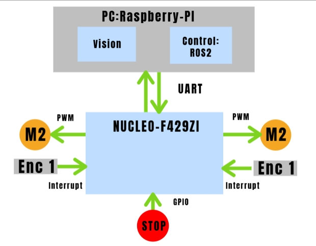

# **Robot Móvil Autónomo para Búsqueda y Localización de Personas**

**Autor: \[Brian Alex Fuentes Acuña]**

**Padrón: \[101785]**

**Fecha: 1er cuatrimestre 2025**

---

### **1. Selección del proyecto a implementar**

#### **1.1 Objetivo del proyecto y resultados esperados**

El objetivo de este proyecto es desarrollar un robot móvil diferencial con capacidades de operación manual y autónoma, enfocado en tareas de búsqueda y localización de personas. 
Se busca que el robot pueda ser controlado de manera remota, conmutar entre modos de operación y detectar personas usando visión artificial.

Entre los resultados esperados se incluyen:

* Navegación diferencial básica.
* Control del motor con interrupciones externas.
* Conmutación de modos manual/automático.
* Detección de personas mediante cámara.
* Publicación de coordenadas y velocidades vía UART.
* Activación de un botón de emergencia para detener el sistema.
* Modularización del firmware en Mbed OS.

#### **1.2 Proyectos similares**

Se consideraron tres posibles variantes del sistema robótico: 

1. **Robot móvil diferencial básico controlado manualmente.**
2. **Robot móvil con operación automática, navegación autónoma básica.**
3. **Robot móvil inteligente con visión y planificación autónoma.**

Se evalúan en base a los siguientes criterios:

1. Disponibilidad del hardware.
2. Nivel de autonomía alcanzable.
3. Facilidad de implementación y modularización en Mbed OS.
4. Costo total estimado.
5. Escalabilidad hacia un sistema más completo (ej. SLAM o HRL).
6. Interés personal y motivación.
7. Conocimientos a adquirir (quizá el aspecto más importante).
8. Tiempo de implementación (cuando menos tiempo lleve, mejor).
9. Trabajos similares (en los que me pueda apoyar o guiar).

Ponderaciones asignadas (1 a 10): 
Disponibilidad del hardware: 10,
Nivel de autonomía: 7,
Facilidad de implementación: 3,
Costo: 6,
Escalabilidad: 8,
Interés personal: 8,
Conocimientos a adquirir: 10,
Tiempo de implementación: 7,
Trabajos similares: 7.

| Criterio                    | Peso | Robot Manual | P. Ponderado | Robot Autónomo Básico | P. Ponderado | Robot con Visión + Planificación | P. Ponderado |
| --------------------------- | ---- | ------------ | ------------ | --------------------- | ------------ | -------------------------------- | ------------ |
| Disponibilidad del hardware | 10   | 10           | 100          | 6                     | 60           | 6                                | 60           |
| Nivel de autonomía          | 7    | 1            | 7            | 8                     | 56           | 10                               | 70           |
| Facilidad de implementación | 3    | 9            | 27           | 6                     | 18           | 4                                | 12           |
| Costo                       | 6    | 9            | 54           | 2                     | 12           | 5                                | 30           |
| Escalabilidad               | 7    | 2            | 14           | 8                     | 56           | 10                               | 70           |
| Interés personal            | 8    | 2            | 16           | 8                     | 64           | 10                               | 80           |
| Conocimientos a adquirir    | 10   | 2            | 20           | 7                     | 70           | 10                               | 100          |
| Tiempo de implementación    | 7    | 8            | 56           | 8                     | 56           | 6                                | 42           |
| Trabajos similares          | 7    | 10           | 70           | 10                    | 70           | 8                                | 56           |
| **Total**                   | —    | —            | **274**      | —                     | **462**      | —                                | **520**      |

<em>Tabla 1.2.1: Comparación de alternativas de robot móvil</em>

#### **1.3 Selección de proyecto**

A partir del análisis anterior, se decide implementar el **Robot móvil inteligente con visión y planificación autónoma** con capacidad de operación manual y automática, integrando control diferencial, sensores, comunicación UART, y un pipeline básico de visión artificial para detectar personas. Esta alternativa brinda un equilibrio entre factibilidad, interés y potencial de escalabilidad hacia arquitecturas más complejas como SLAM o control jerárquico.

El sistema se implementará sobre una **placa STM32 NUCLEO-F429ZI**, utilizando **Mbed OS**, con una estructura de código modular basada en directorios como `hardware/`, `control/`, `motion/`, `modes/`, entre otros.

Se prioriza el cumplimiento funcional y la claridad estructural del proyecto, permitiendo futuras mejoras como:

* Carga de modelos de aprendizaje automático.
* Mejora de sensores físicos reales (encoders, IMU, cámaras).

Los principales desafíos del proyecto incluyen el manejo eficiente del tiempos de control, la gestión de múltiples modos de operación, y la simulación realista de sensores en ausencia de hardware físico.

###### **1.3.1 Diagrama en bloques**

  

<em>Figura 1.3.1: Diagrama en bloques del sistema robótico</em>

---

### **2. Elicitación de requisitos y casos de uso**

El robot busca cumplir funciones prácticas en escenarios donde se requiera una solución de bajo costo para tareas de reconocimiento y localización de individuos. Este tipo de aplicaciones puede ser útil en proyectos de rescate, vigilancia o navegación autónoma en entornos desconocidos.

Algunos productos medianamente similares existentes son los robots comerciales de tipo Roomba, con navegación semiautónoma, o kits educativos como los basados en Arduino o Raspberry Pi. Sin embargo, pocas soluciones están adaptadas a placas STM32 + Raspberry Pi para este tipo de tareas.

Entre los proyectos similares se encuentran:

[Andino](https://github.com/Ekumen-OS/andino/tree/0c4bc2077722d1f7c7e5c803cb0a9abce48df3f9): un proyecto open-source basado en ROS2 Humble con muchos simuladores disponibles y usan raspberry pi + arduino puede realizar navegaciones o mapeos usando LIDAR.

[Diffbot](https://github.com/ros-mobile-robots/diffbot/tree/noetic-devel): un proyecto open-source basado en ROS Noetic, usa el simulador Gazebo y puede realizar navegaciones o mapeos usando LIDAR.

[TurtleBot](https://www.turtlebot.com/): Un robot comercial destinado a la investigación en robótica móvil, puede realizar navegaciones o mapeos usando LIDAR y tiene una cámara para propósitos generales sin embargo un robot de este tipo suele tenes un precio que ronda los cientos a miles de dolares.

La mayoria de estos proyectos no tiene en ecuenta el uso de una cámara para la navegación y se basan en lidar para una nevagacion basica, si bien es muy interesante el hecho de usar el LIDAR (muy caro) lo hace inviable para este proyecto, por lo que se opta por usar una cámara (~barato) para la navegación.

| Grupo        | ID  | Descripción                                                                        |
| ------------ | --- | -----------------------------------------------------------------------------------|
| Movimiento   | 1.1 | El sistema permitirá el movimiento hacia adelante.                                   |
|              | 1.2 | El sistema permitirá el girar el robot hacia la izquierda y derecha.                 |
|              | 1.3 | El sistema controlará la velocidad de los motores.                                 |
|              | 1.4 | El sistema podrá detener completamente al robot.                                   |
| Acceso       | 2.1 | El sistema permitirá el control manual del robot por comando UART.                 |
|              | 2.2 | El sistema permitirá conmutar al modo automático para realizar búsquedas.          |
|              | 2.3 | El sistema permitirá conmutar al modo automático de forma dinámica.                |
| Visión       | 3.1 | El robot detectará personas en la imagen usando un algoritmo básico de visión.     |
|              | 3.2 | El robot detectará personas y navegara hacia la misma permitiendo su localización. |
| Comunicación | 4.1 | Se enviarán coordenadas y velocidades por UART para monitoreo externo.             |
| Seguridad    | 5.1 | El sistema se detendrá al presionar el botón de emergencia.                        |
| FeedBack     | 6.1 | El sistema usara LEDs para indicar el modo de operación.                           |

| Elemento                | Definición                                                                                                                                                                                                                                                                                           |
| ----------------------- | ---------------------------------------------------------------------------------------------------------------------------------------------------------------------------------------------------------------------------------------------------------------------------------------------------- |
| **Disparador**          | El usuario quiere controlar el robot manualmente mediante comandos UART.                                                                                                                                                                                                                             |
| **Precondiciones**      | El sistema está encendido. El botón de emergencia no está presionado. El robot está en modo manual.                                                                                                                                                                                                  |
| **Flujo principal**     | El usuario envía comandos UART para mover el robot (adelante, giro, parar). El sistema ajusta la velocidad de los motores. El sistema responde con el estado actual del robot.                                                                                                                |
| **Flujos alternativos** | a. El usuario envía un comando inválido. El sistema ignora el comando y responde con un mensaje de error.   b. El botón de emergencia es presionado. El robot se detiene inmediatamente y lo informa.   c. El usuario cambia al modo automático. El sistema deja de recibir comandos manuales. |

| Elemento                | Definición                                                                                                                                                                                                                                                            |
| ----------------------- | --------------------------------------------------------------------------------------------------------------------------------------------------------------------------------------------------------------------------------------------------------------------- |
| **Disparador**          | El usuario cambia al modo automático.                                                                                                                                                                                                                                 |
| **Precondiciones**      | El sistema está encendido. El botón de emergencia no está presionado. El robot está en modo automático.                                                                                                                                                               |
| **Flujo principal**     | El sistema ejecuta una lógica predefinida para moverse (ej., grid search). Usa odometría e imágenes como entrada. Controla motores según su algoritmo de navegación. Informa la velocidad y coordenadas por UART.                                                       |
| **Flujos alternativos** | a. Se detecta un obstáculo. El robot gira o se detiene según la lógica.   b. El usuario presiona el botón de emergencia. El robot se detiene.   c. Se pierde las informacion de entrada. El robot se detiene y lo notifica. |

| Elemento                | Definición                                                                                                                                                                    |
| ----------------------- | ----------------------------------------------------------------------------------------------------------------------------------------------------------------------------- |
| **Disparador**          | Se presiona el botón de emergencia.                                                                                                                                           |
| **Precondiciones**      | El sistema está encendido. El robot está en cualquier modo.                                                                                                                   |
| **Flujo principal**     | El sistema detiene inmediatamente los motores y bloquea el movimiento. Se enciende un LED rojo o se activa una alarma visual. Informa al usuario vía UART del evento.         |
| **Flujos alternativos** | a. El botón de emergencia es liberado(manteniéndolo presionado durante 10 segundos). El sistema permite reanudar la operación.   b. Se intenta mover el robot mientras la emergencia sigue activa. El comando se ignora. |
